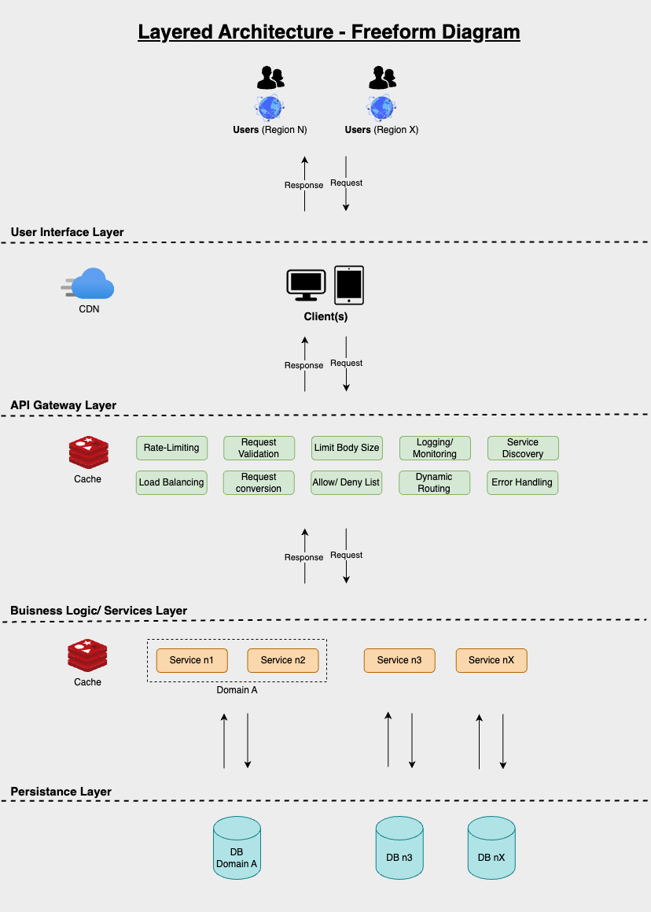
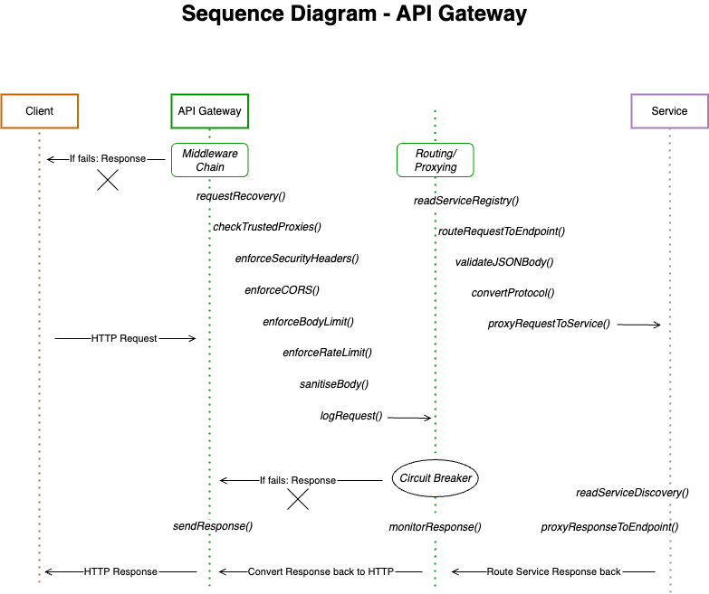
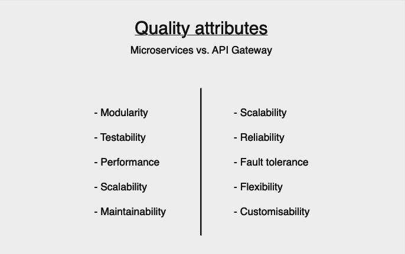
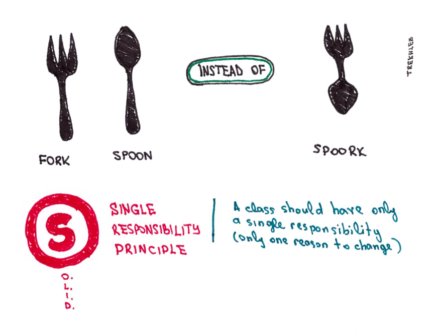

# API Gateway Documentation

## SE_35 Module related contribution list

- Diagrams: Freeform and Sequence and UML diagram  
  - [Freeform diagram](https://github.com/lucdoe/capstone_gateway/raw/main/docs/layerd.png): Overview of an API Gateway setup in a Freeform setup. 
  - [Sequence diagram](https://github.com/lucdoe/capstone_gateway/raw/main/docs/sequence_diagram.png): Describing as a UML diagram of how a request is being
    processed through the Gateway.
  - [UML Diagram](https://github.com/lucdoe/capstone_gateway/raw/main/docs/uml.png)
- Quality attributes: [API Gateway Quality attributes](https://github.com/lucdoe/capstone_gateway#design-patterns-and-quality-attributes-of-an-api-gateway)
- SOLID Principles (focusing on S and D): 
  - Single Responsibility: [Custom Rate Limiter](https://github.com/lucdoe/capstone_gateway/blob/main/internal/middlewares/limiter.go), [Custom Logger](https://github.com/lucdoe/capstone_gateway/blob/main/internal/middlewares/logger.go) 
  - Dependency Inversion: [Interface/ Struct abstractions](https://github.com/lucdoe/capstone_gateway/blob/main/internal/types.go), [Dependency Injection](https://github.com/lucdoe/capstone_gateway/blob/main/internal/app/app.go)
  - Both principles contribute to easier [testability](https://github.com/lucdoe/capstone_gateway/blob/main/tests/internal/app/app_test.go) and flexibility in terms of other libraries or implementations.
  - Example for both SRP and DIP: [Implementation of YAML Config loader (loads service registry)](https://github.com/lucdoe/capstone_gateway/blob/main/internal/config_loader.go)
- Design Patterns: [Server-side discovery pattern (Service Registry)](https://github.com/lucdoe/capstone_gateway/blob/main/endpoints.yaml), [Proxy Pattern](https://github.com/lucdoe/capstone_gateway/blob/main/internal/app/app.go) (gateway forwarding request to services and running middlewares before and after), API Gateway itself is a pattern, [Chain of Responsibility Pattern](https://github.com/lucdoe/capstone_gateway/blob/main/internal/middlewares/init.go) (Middlewares)

## Introduction

This repo covers an easy-to-use, customizable and maintainable API Gateway. The documentation covers what design patterns are incorporated into it and what we value in design from maintainers. The motivation to create this repo came from a Monolith to Microservice project where an API Gateway was needed to route the traffic to the services.

The documentation covers what an API Gateway is and why it is necessary. It jumps into an example setup of an API Gateway in a Microservice setup where common tasks are also covered. From there, it details the underlying design patterns typically used in an API gateway and how the quality attributes differ from microservices. 
Towards the end, it details what structure the codebase is in and why the S and D of the SOLID principles are mostly used over others for this codebase. The last part covers how to use the Gateway and who contributed to it.

## What is an API Gateway?

An API Gateway is a single entry point for clients, acting like a reverse proxy for managing and routing requests, making it especially useful for microservice architectures.
The gateway layer can handle typical tasks that would otherwise be governed by each service individually so the services can concentrate on one domain-specific task. This central layer between the client and the services allows monitoring, caching, analytics, and request conversion.

To identify what services, the API gateway accesses a service registry to look up registered services. The Gateway is, therefore, entirely decoupled from the services.
That makes the circuit breaker pattern an essential tool where a certain number of services can fail or retry before a request fails.

Generally, there are fewer requests due to the orchestration of an API Gateway, although it adds another hop in the network.

### Why is an API Gateway necessary?

The adoption of the microservice pattern introduced new challenges for clients. With services being dynamically redeployed several times daily, a mechanism was needed to route the request to the right services. All services have to handle tasks like rate-limiting and other common things to check the request, which is not part of the domain of service due to the single responsibility principle.
Here is where an API Gateway can come in and handle the addressed issues. As the single entry point, the API gateway is aware of its registered services and can perform the expected task formerly performed by the services. In that way, the services can focus on the domain logic and get uniform and safe requests through that single entry point, the API Gateway.

### Example setup of an API Gateway

In the following diagram, you can see how and where an API Gateway fits into your architecture:

The API Gateway receives the request from the client, performs some action on it, and then routes the request to the receiving service. The diagram makes the central point and tasks that can be performed more evident.
Another use case is a Backends for Frontends approach. In this case, each client has its own Gateway, as the name suggests. So if there are three clients, mobile, web and native, each would have its entry point into the system through its own Gateway.

### Common tasks of an API Gateway

The idea of two possible architecture setups leads nicely into what exactly an API Gateway does internally; as mentioned before, an API Gateway is mainly responsible for routing or proxying responses which come in. But the central point where all requests flow through allows for more actions we can perform on that layer. The following section will introduce some shared tasks an API Gateway could have on top of what has been mentioned. Just note that the API gateway does not have to perform all the following functions:

- Rate Limiting (Could be service specific)
- Enforce Security headers
- Sanitisation
- Body Size Limiting (could also be fine-grained to each service)
- CORS policy
- Logging/ Monitoring
- Load balancing (although not a typical task of an API gateway, it is a great place to perform that task due to the service orchestrating nature)
- Request conversion (standard HTTP coming from the client, but gRPC or GraphQL is used by the server)
- Dynamic Routing
- Request validation (JSON body undergoes validation, or individual headers have to be present)
- Allow/deny requests
- Authorisation/ Authentication
- Caching (saving even more requests comes with the complexity of handling complexities with caches)

A possible flow of tasks can be seen in the following diagram:

### Design Patterns and Quality Attributes of an API Gateway

The overall pattern making API Gateways exist is the microservice pattern. In this pattern, one structures the application in a set of independently deployable, loosely coupled components called services.

The API gateway is a design that solves the problems introduced by microservices.
One is the Circuit breaker pattern, which comes from electrical engineering and refers to a set of switches, and when a threshold of these switches fails, the whole operation down the line also fails. In the API gateway, this pattern is used to ensure, even when retrying, that further requests down the line are not even executed to save resources.

Another essential pattern for API gateways is the Server-side discovery pattern, which essentially allows the Gateway to know about the services underneath through a Service Registry. Our browser daily uses a use case for that pattern, DNS, which lists IP addresses and their domains.  
A more structural pattern necessary for an API Gateway is the Proxy pattern. It allows the Gateway to perform something before or after the request gets to the services/client. An example would be the attached middleware chain, shown in graphics 1 and 2.  
The middleware chain by itself is a pattern. It is called the Chain of Responsibility, a creational pattern. Each handler decides to process the request or pass it to the next handler in the chain.

A pattern that uses the API Gateway pattern is the earlier mentioned Backends for Frontends pattern. It is a specific use case for applying an API Gateway in practice. Each client has its entry point into the application architecture, allowing client-specific setups.

Microservices and API gateways solving different tasks also come with varying quality attributes. Whereas an API Gateway needs to scale well and be reliable, Microservices are very modular and focused on performance and maintainability.

## About the Capstone API Gateway

The Capstone API Gateway is a choice if you want an easy-to-use and customisable API Gateway. Unlike other products, the idea of this project is to be set up quickly and without much configuration (although if you want, you can!).

- <b>Configurability:</b> The Capstone API Gateway is highly customisable. Whatever you want to change, you can.

- <b>Rapid Deployment:</b> With a boilerplate tailored to your needs, you will quickly get ready to deploy your architecture and can focus on building your business logic.

- <b>Declarative YAML Config:</b> Your services are being registered via a YAML configuration. Most of what you need you can configure here.

### Codebase Patterns

#### UML diagram

#### SOLID Principles

This codebase tries to adhere to the SOLID principles and invites all maintainers and users to do so. Also, change it if you spot places where this could be improved. Especially the Single Responsibility Principle (SRP) and the Dependency Inversion principle (DIP) should be applied, and others can be discarded if these two are present.

A great Blog about SOLID on dev.to (Oleksii Trekhleb, 2020) has some easy-to-understand graphics introducing the two ideas, the first one being the SRP:

The second important principle we invite you to apply is the DIP:

Images coming from: Oleksii Trekhleb. (2020, March 29). S.O.L.I.D. Principles Around You. DEV Community; DEV Community. https://dev.to/trekhleb/s-o-l-i-d-principles-around-you-1o17

Even though this is a Golang codebase and not necessarily strict object-oriented programming, the principles help to create cleaner and more maintainable code.

## How to use this API Gateway

Pull the repo and go through the process of creating the API Gateway server and use it as is (full-fledged option).

The way to register services resides in the `endpoints.yaml`, where you will find a possible setup of services. Just update that file with your configuration and services, and when starting the server, the configuration will be loaded and applied.

Your services must be available on the specified endpoints in the `endpoints.yaml`.

    cd location_of_pulled_repo

    go run main.go

Happy API Gatewaying!

## Contribution List

This project is currently only maintained by Lucca Doerrstein.

## Refrences

Clean Coder Blog. (2023). Cleancoder.com. https://blog.cleancoder.com/uncle-bob/2012/08/13/the-clean-architecture.html

Oleksii Trekhleb. (2020, March 29). S.O.L.I.D. Principles Around You. DEV Community; DEV Community. https://dev.to/trekhleb/s-o-l-i-d-principles-around-you-1o17
